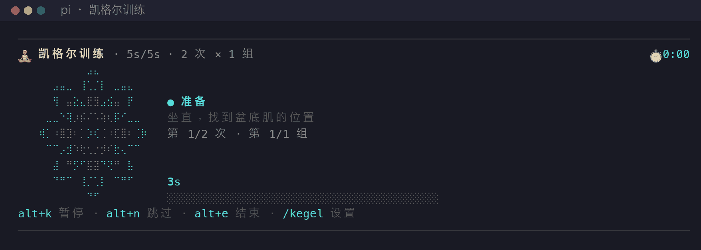
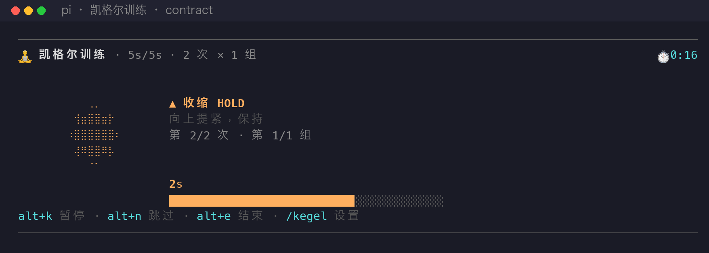
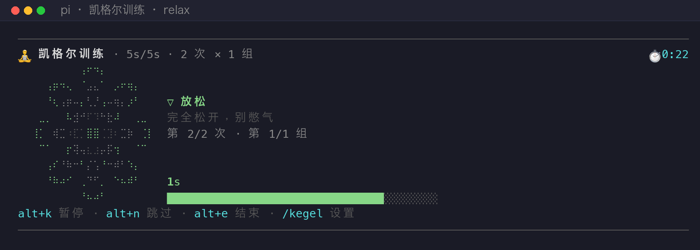
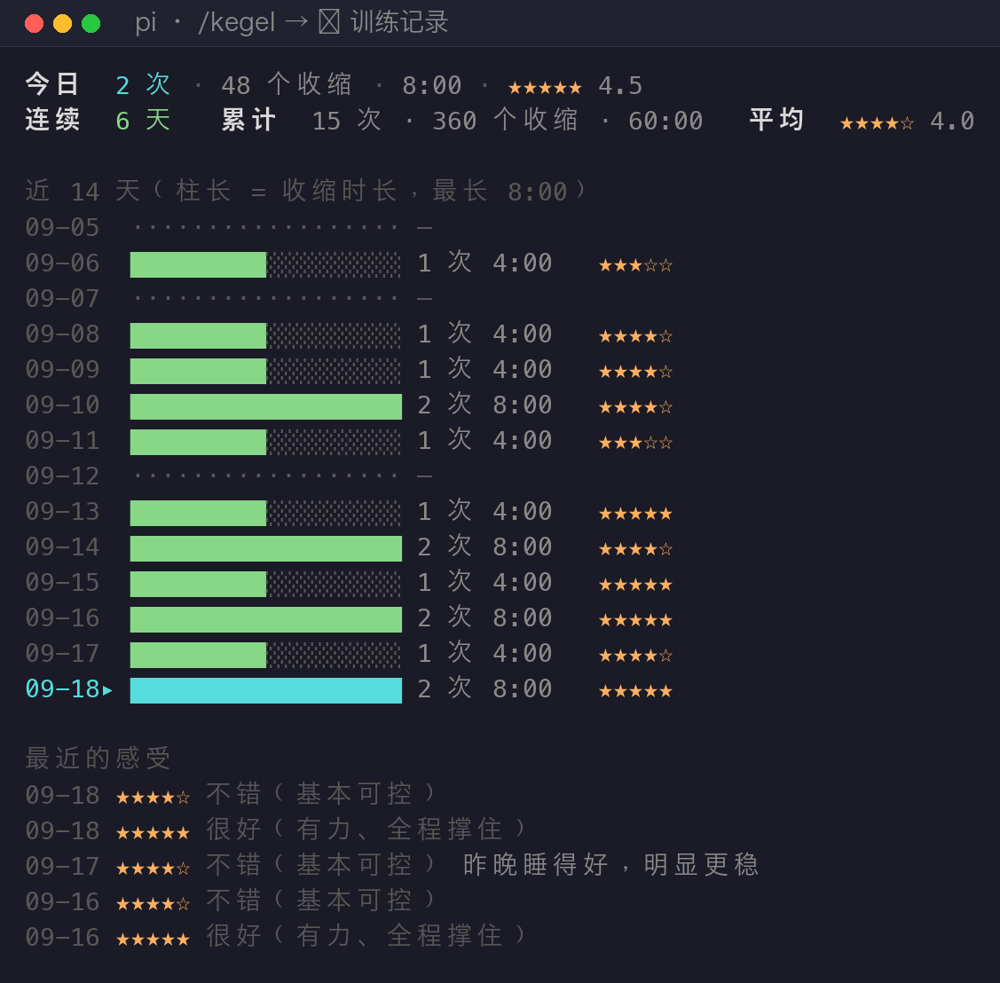

# pi-kegel 🧘

**在等模型干活的时候练凯格尔。**

一个 [pi](https://github.com/earendil-works/pi) 扩展：模型开始「打字」时，输入框上方自动浮出一朵用盲文点阵画的呼吸花，收缩 10 秒、放松 10 秒，练完自动收起。不用记时间、不用看表、不用额外打开 App —— 等 Claude 写代码那几分钟，顺手就把盆底肌练了。



上面是一次完整训练的回放（为了动图短，压成了 4.3 倍速；实际是 10 秒收紧 / 10 秒放松）。

| 收紧 —— 花瓣被攥成花苞 | 放松 —— 花瓣绽开 |
|---|---|
|  |  |

---

## 目录

- [为什么做这个](#为什么做这个)
- [安装](#安装)
- [用法](#用法)
- [花瓣可视化](#花瓣可视化)
- [音效 / 语音报数](#音效--语音报数)
- [训练记录](#训练记录)
- [难度表](#难度表)
- [配置](#配置)
- [快捷键](#快捷键)
- [已知限制](#已知限制)
- [开发](#开发)
- [安全提示](#安全提示)
- [English](#english)

---

## 为什么做这个

凯格尔训练的核心难点不是「怎么做」，是**坚持**。它的处方很无聊：每天 3 组、每组 10 次、每次收紧 10 秒 —— 大概 3 分钟，但要天天做，而且做的当时你没法干别的事（要专心感受盆底发力）。

而「等 AI 写代码」正好是这样一段时间：你盯着屏幕、脑子闲着、手也闲着，但又不想切出去干别的。这 3 分钟就该拿来练。

所以这个扩展的核心设计是**零启动成本**：不需要「我今天要练」这个决定，模型一开工，花就开了。练完它问你一句「这次感觉如何」，然后自己消失。

---

## 安装

```bash
git clone https://github.com/cheers666-max/pi-kegel.git ~/.pi/agent/extensions/kegel
```

然后**重开 pi**（扩展在启动时加载）。装好后输入 `/kegel` 应该能看到菜单。

更新：

```bash
cd ~/.pi/agent/extensions/kegel && git pull
```

> 单个文件不想用 git 也行：把 `index.ts` / `core.ts` / `widget.ts` / `bloom.ts` / `history.ts` 五个文件丢进 `~/.pi/agent/extensions/kegel/` 即可。

## 用法

启动 pi，正常发消息。模型开始工作时：

1. 输入框上方浮出一朵花 + 倒计时（准备 3 秒）
2. **收紧**：像憋尿一样向上提，保持到花聚成苞、倒计时归零
3. **放松**：完全松开（这一步比收紧更重要，别一直提着）
4. 重复 8 次为一组，共 3 组，组间休息 30 秒
5. 练完问你「这次感觉如何？」，1-5 分选一个，然后花收起来

全程不用碰键盘 —— 但想控制也行：

| 操作 | 快捷键 | `/kegel` 命令 |
|---|---|---|
| 暂停 / 继续 | `alt+k` | `/kegel pause` |
| 跳过当前阶段 | `alt+n` | `/kegel next` |
| 提前结束 | `alt+e` | `/kegel stop` |
| 打开菜单 | — | `/kegel` |
| 直接开始某个难度 | — | `/kegel quick` 等 |

---

## 花瓣可视化

花是用 **Braille 点阵**（U+2800–U+28FF）画的：一个字符格 = 2×4 个点，所以一朵花只占十几个字符宽，在终端里能量出圆滑的边缘。它跟着呼吸曲线缩放：

- **收紧**时花瓣被攥成花苞（直径缩到约 1/2.6）
- **放松**时花瓣绽开
- 阶段交接处按「聚拢必从全开起步、绽开必从花苞起步」设计，所以不会突跳（有测试守着）
- 闲置阶段（准备 / 组间休息）花会轻轻呼吸，提示你「下一次收缩的起点在哪」

方向可以反过来（`花瓣绽开于：收缩时`），有些人觉得反过来更顺 —— 在设置里一键切换，立即生效。

尺寸随终端高度自适应（约占 1/3 屏高）；终端太矮（< 26 行）或太窄（< 36 列）时自动退化成紧凑进度条。

---

## 音效 / 语音报数

每个阶段切换都有声音，不用盯屏幕：

| 时刻 | 系统音 | 语音模式 |
|------|--------|---------|
| 准备开始 | `Morse` | 准备 |
| 开始**收紧** | `Tink`（清脆、高） | 收紧 |
| 开始**放松** | `Blow`（吹气、软） | 放松 |
| 组间休息 | `Purr`（喉音） | 休息 |
| 阶段最后 N 秒（每秒一次） | `Pop`（音量降到 45%） | 3 / 2 / 1 |
| 完成 | `Glass`（铃） | 完成 |

- **滴答**（默认最后 3 秒）：边界快到了提醒你，可以闭眼练。短于 3.5 秒的阶段不滴答（否则快肌 1/1 会变成哒哒哒噪音）
- **语音模式**：用 macOS `say` 念（默认 `Tingting`），像教练在报数，适合闭眼跟练
- **音量**：`afplay -v`，0-100%
- 只在 **macOS** 上有效（依赖 `afplay` / `say`），其他平台静默

## 训练记录

每次**完整练完**（手动 `alt+e` 结束的不算）自动记一笔，并问你 1-5 分：

| 分数 | 含义 |
|---|---|
| 5 | 很好（有力、全程撑住） |
| 4 | 不错（基本可控） |
| 3 | 一般（勉强完成） |
| 2 | 偏差（找不到发力感） |
| 1 | 很差（疼痛 / 漏尿 / 完全使不上力） |

评分不是仪式感 —— 盆底肌训练最怕「练错了还不知道」，1-2 分连着出现就该去看医生，或者说明你太累了。

`/kegel` → **📈 训练记录** 可以看：



- 今日练了几次、几个收缩、总时长、当天平均感受
- 连续天数（今天还没练也不算断）、累计量、历史平均感受
- 近 N 天柱状图（柱长 = 收缩时长，中间的空档会显示成 `·····`，不会偷偷跳过）
- 最近 5 次感受 + 备注

还能在同一个菜单里：给最近一次改分、写备注、改显示天数、清空全部记录。

数据存在 `~/.pi/agent/kegel-history.jsonl`（一行一次训练），纯文本、可 grep、可备份：

```bash
# 最近一周每天练了多少
tail -7 ~/.pi/agent/kegel-history.jsonl | jq -r '"\(.at|todate) \(.reps)次"'
```

> 记录里存的是：时间戳、完成次数、组数、收缩/放松秒数、累计收缩时长、训练总时长、是否练完、评分、备注。**没有任何个人身份信息**，也不联网。

---

## 难度表

| 难度 | 处方 | 说明 |
|---|---|---|
| 快肌 | 1s / 1s × 10 × 3 | 练快肌纤维，节奏很快 |
| 入门 | 3s / 6s × 10 × 3 | 找不到发力感时从这个开始 |
| 轻量 | 5s / 10s × 10 × 3 | |
| **标准** | **10s / 10s × 8 × 3** | 默认，也是最常见的临床处方 |
| 加强 | 10s / 5s × 10 × 3 | 放松时间短，强度更大 |
| 耐力 | 15s / 10s × 8 × 3 | |
| 自定义 | 任意 | 收缩 1-120s、放松 1-120s、次数、组数、组间休息 |

## 配置

`/kegel` → ⚙️ 其它设置：

| 项 | 默认 | 说明 |
|---|---|---|
| 音效 | 系统音 | `系统音`（含音量）→ `语音` → `关` |
| 结束前滴答 | 最后 3 秒 | 0-10 秒或关 |
| 可视化 | 花瓣绽放 | 或进度条 |
| 花瓣绽开于 | 放松时 | 或「收缩时」 |
| 记录训练 | 开 | 关掉后不再写入（已有记录保留） |
| 练完询问感受 | 开 | 关掉就不弹 1-5 分 |
| 模型开始工作时自动开始 | 开 | |
| 模型结束后自动结束 | 关 | |
| 模型空闲时自动暂停 | 开 | 模型干完活、训练还没做完时自动冻结计时，你下次发消息再接着走 |
| 准备倒计时 | 3s | |

配置写在 `~/.pi/agent/kegel.json`：

```json
{
  "contractSec": 10,
  "relaxSec": 10,
  "reps": 8,
  "sets": 3,
  "setRestSec": 30,
  "prepareSec": 3,
  "cue": "system",
  "volume": 0.7,
  "tickLastSec": 3,
  "voice": "Tingting",
  "visual": "bloom",
  "bloomOn": "relax",
  "log": true,
  "askRating": true,
  "historyDays": 14
}
```

## 快捷键

**如果在 Ghostty / Terminal.app 下 `alt+k` 没反应**：这两个终端默认 `macos-option-as-alt = false`，Option+K 发出的是组合字符 `˚` 而不是 `ESC k`。扩展已经做了兜底 —— 训练期间它直接拦截 `˚` / `˜` / `´` 三个字符，所以**开箱即用，不用改终端配置**。

想更稳妥，可以在 Ghostty 配置里加：

```ini
macos-option-as-alt = true
```

另外 `ctrl+shift+k` / `ctrl+shift+n` / `ctrl+shift+e` 是无冲突的备用键（需要终端支持 kitty 键盘协议）。

## 已知限制

- **音效仅 macOS**：依赖 `afplay` / `say`
- **模型写超长回复时才开始练**：如果它只回一句话（几秒），训练刚开始就被下一轮打断 —— 这时 `模型空闲时自动暂停` 会把它冻住，等你下次发消息继续
- **排队消息不触发重新开始**：agent 忙时你追加的消息属于同一个 run，扩展靠 `turn_start` 兜底重新武装（已测）
- **`alt+k` 是全局快捷键**：训练没开时按下只会被忽略，但会占用这个组合键
- **Braille 花需要等宽字体**：终端字体没有 U+2800–28FF 时会显示成方框（Ghostty / iTerm / Terminal.app 默认字体都有）
- 不是医疗器械，不替代医生

## 开发

三个纯逻辑模块都可以脱离 pi 独立跑：

```bash
# 单元测试：状态机 + 呼吸曲线 + 点阵渲染 + 记录聚合（33 项）
node --experimental-strip-types core.test.ts

# 重新生成 README 素材（需要装过 pi，脚本会自己找 pi-tui）
node --experimental-strip-types tools/render-frames.mjs
python3 tools/make-assets.py
python3 tools/verify-assets.py   # 无需肉眼：查缺字、查花真的在缩放
```

文件分工：

| 文件 | 职责 |
|---|---|
| `core.ts` | 状态机 + 配置校验（纯逻辑，零 TUI 依赖） |
| `bloom.ts` | Braille 点阵花的几何与呼吸曲线（纯函数） |
| `history.ts` | 训练记录的数据层 + 报表渲染（纯函数） |
| `widget.ts` | 把状态画成终端组件 |
| `index.ts` | 扩展入口：事件订阅、快捷键、音效、菜单编排 |
| `core.test.ts` | 单元测试 |

`tools/` 里的两个脚本会加载**真实的** `widget.ts` / `bloom.ts` / `history.ts` 来出图，所以 README 里的截图不可能和实际渲染脱节。

## 安全提示

- 收紧时**不要憋气**，正常呼吸（这也是花上不显示「用力」提示的原因之一）
- 放松阶段要真的松开，一直半提着练反而有害
- 排尿时**不要**用这个练（会干扰排尿反射）
- 出现疼痛、明显漏尿加重，停练并看医生

## English

A [pi](https://github.com/earendil-works/pi) extension that turns the time you spend waiting for the model into pelvic-floor training.

When the agent starts working, a Braille-drawn flower blooms above the editor: 10s contract, 10s relax, 8 reps × 3 sets, with an optional 1-5 "how did that feel" rating and a daily training log. Sound or spoken cues let you train eyes-free.

- **Install**: `git clone https://github.com/cheers666-max/pi-kegel.git ~/.pi/agent/extensions/kegel`, then restart pi
- **Control**: `/kegel` for the menu, `alt+k` pause, `alt+n` skip, `alt+e` end
- **Log**: `/kegel` → 训练记录 — per-day volume, streak, average rating, ASCII chart
- **macOS only** for audio cues; the rest works anywhere pi runs

## License

MIT
